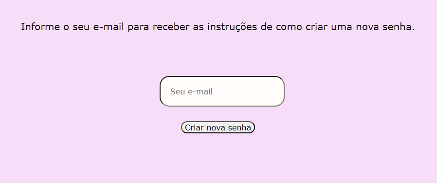

# form_login
Form login 2 é a melhora do site form login, onde foi adicionado a funcionalidade de lembrar a senha.

## 📋 Sobre o Form-login
O projeto de form-login foi realizado composto pela seguinte matéria:

### Programação web I
Criamos um web site para conseguirmos ter contato nossos clientes e estilizamos usando VSCode. Em seguida criamos um form-login para conseguirem ter acesso a sua conta. E agora adicionamos a opção de lembrar a senha.

## Imagens do site

## 📄 Descrição do projeto
Form-login foi criado durante as aulas de programação web I, anteriormente criamos um web site do nosso form-login, e agora fizemos uma melhora adicionando o "Esqueceu sua senha?". Essa adaptação foi criada para ajudar os nossos clientes caso esqueçam sua senha. O esqueceu sua senha normalmente esta nas páginas iniciais, abaixo do "entrar".

## 🛠️ Tecnologias  
* HTML
* CSS
* JavaScript
### 🔧 Ferramentas
* VSCODE
* GitHub
### Sites Utilizados
* Github
